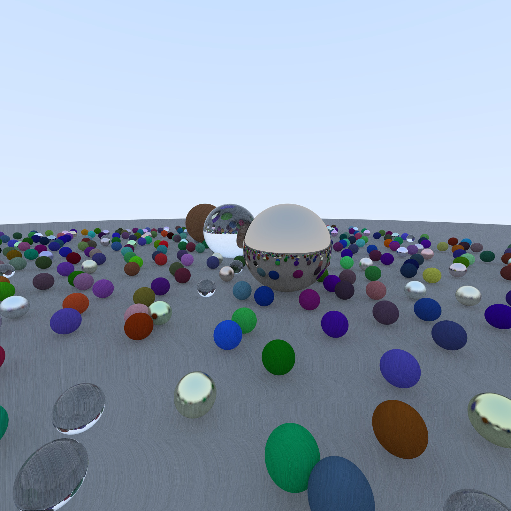
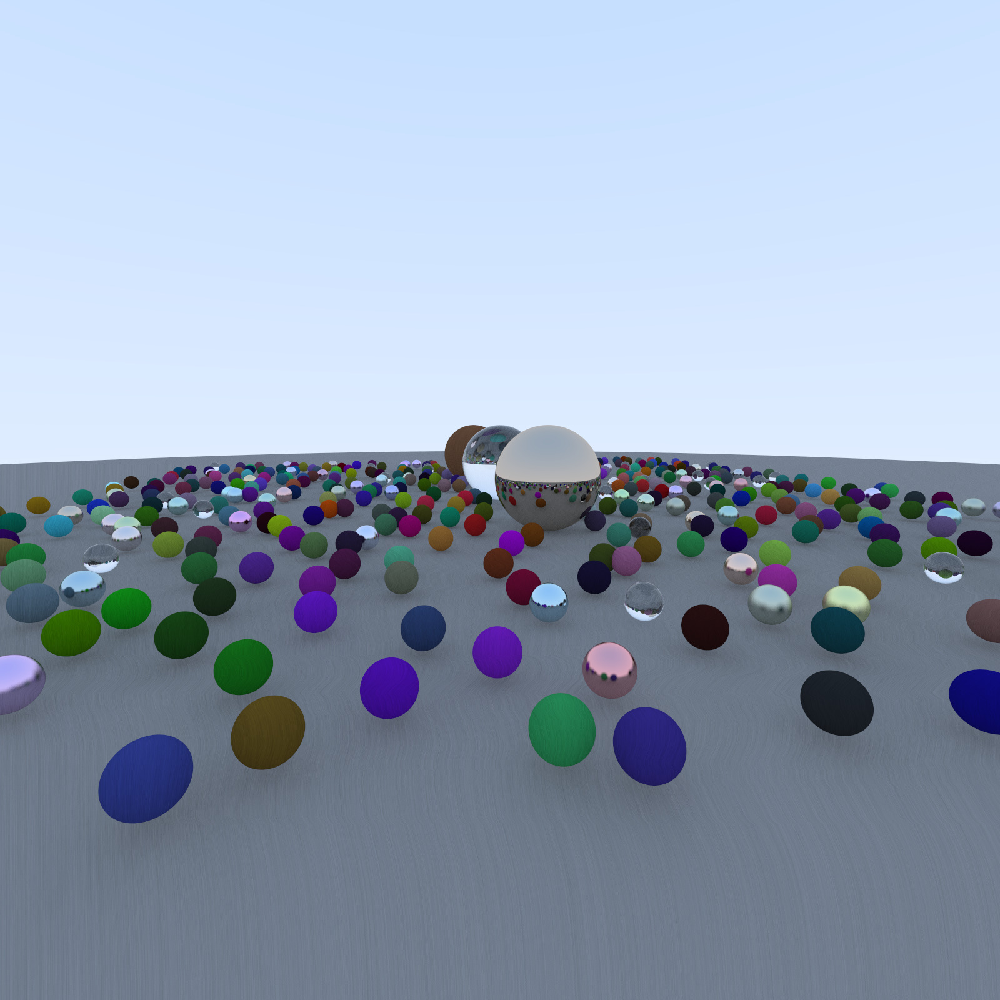

# ray_tracer
A **learning** repo for https://raytracing.github.io/

ALL HONOR BELONGS TO Peter Shirley.

# 目标
- [ ] 完成三本ray tracer
- [ ] cpu并行/移植到cuda上

# 当前
环境: Intel E2630

- [x] ray tracing in one weekend(cpu并行,1600p x 1600p x 100 samples,渲染时长: 290s)

- [x] Bounding Volume Hierarchies优化 (CPU并行，1600p x 1600p x 300 samples,渲染时长: 80.1s)

